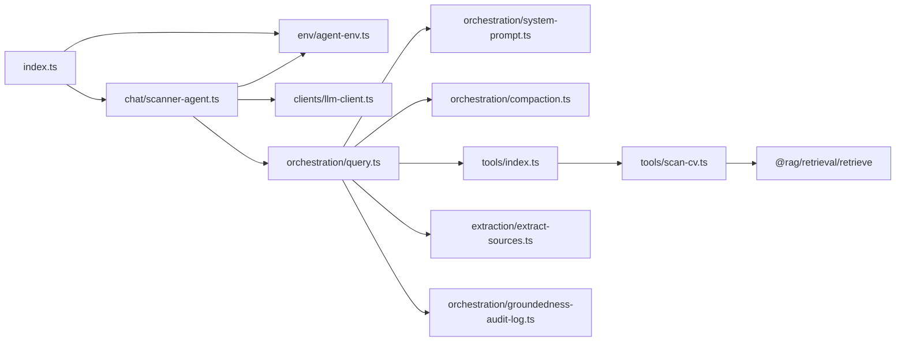
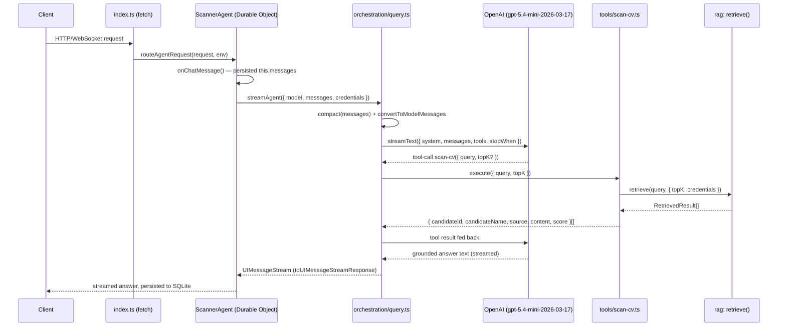

# Agent — Orchestration

`agent` is the third of the four `src/` modules (see [docs/architecture.md](../docs/architecture.md)).
It turns a user's question, plus `rag`'s retrieved CV text, into a grounded streamed answer with
source references. It is a Cloudflare Worker: a `ScannerAgent` Durable Object (built on
`@cloudflare/ai-chat`'s `AIChatAgent`) that streams answers over the AI SDK, reaching CV content
through exactly one function — `rag`'s `retrieve` — offered to the model as a tool it chooses to
call, never a hardcoded step.

This page documents the module **as built** — file by file, with the actual data flow — as opposed
to [openspec/changes/add-agent](../openspec/changes/add-agent/design.md), which records *why* it was
designed this way. Update this page whenever `src/agent/` changes shape; treat the OpenSpec change as
the historical decision record, not the source of truth for current behavior once the two drift.

> This file is plain Markdown with fenced ` ```mermaid ` blocks, the format VitePress renders
> natively once the docs site is wired up — no VitePress-specific syntax is used, so it also renders
> as-is on GitHub today.

## Entry points

Two, per [design.md Decision 5](../openspec/changes/add-agent/design.md#decision-5--one-orchestration-core-two-entry-points):

- **`pnpm dev:agent`** (`wrangler dev`) boots the Worker from `src/agent/index.ts`. A request routes
  through `routeAgentRequest` to the `ScannerAgent` Durable Object, whose `onChatMessage` calls
  `streamAgent` and streams the reply back over the chat transport.
- **`orchestration/query.ts`'s `runAgent`** is a plain async function — no Worker, no Durable Object,
  no HTTP — that the eval harness (a later change) calls directly. Both entry points share the same
  `SYSTEM_PROMPT`, tool record, and step limit, defined once in `orchestration/`.

## Module layout

```
src/agent/
├── index.ts                          entry point — Worker `fetch`, re-exports ScannerAgent
├── tsconfig.json                     editor-only: points Cursor/VS Code at tsconfig.agent.json
├── env/agent-env.ts                  Env contract (secrets + DO namespace), fail-fast readers
├── clients/llm-client.ts             the only file importing @ai-sdk/openai
├── chat/scanner-agent.ts             ScannerAgent extends AIChatAgent<Env>
├── tools/
│   ├── scan-cv.ts                     tool(): description + Zod inputSchema + execute
│   └── index.ts                       the record { "scan-cv": scanCVTool }
└── orchestration/
    ├── system-prompt.ts               SYSTEM_PROMPT: groundedness + scope contracts
    ├── types.ts                       AgentResult, re-exports SourceReference
    ├── compaction.ts                  message-array compaction before the model call
    ├── groundedness-audit-log.ts      TODO(add-agent-evals): temporary audit logging
    ├── query.ts                       streamAgent + runAgent, one shared configuration
    └── integration.test.ts            question → tool → grounded answer, full mocked pipeline
```

Plus `extraction/extract-sources.ts` (tool results → `SourceReference[]`, a pure function). Every
file above has a colocated `*.test.ts` except `index.ts`, `system-prompt.ts`, and `wrangler.jsonc`
(config, no behavior of its own to unit-test).

### Internal dependency graph



`clients/llm-client.ts` is the only file importing `@ai-sdk/openai`; `tools/scan-cv.ts` is the only
file importing `rag`. Neither `orchestration/` nor `extraction/` imports the Cloudflare or OpenAI
SDKs — both stay pure, mockable with `MockLanguageModelV4` (`ai/test`) and in-memory tool results.

## Request flow (`pnpm dev:agent`)



`runAgent` (the eval entry point) follows the identical path from `orchestration/query.ts` downward,
substituting `generateText` for `streamText` and returning `{ text, sources, toolCalls,
retrievedChunks }` instead of a stream.

## Components

### `env/agent-env.ts`
`Env` is the Worker's binding contract: three secrets (`OPENAI_API_KEY`,
`UPSTASH_VECTOR_REST_URL`/`_TOKEN`) plus the `ScannerAgent` Durable Object namespace
(`DurableObjectNamespace<ScannerAgent>`, from `@cloudflare/workers-types`). `requireOpenAiApiKey(env)`
mirrors `rag/env/upstash-credentials.ts`: trims and requires the key, throwing a named error before
any model call. `upstashCredentialsFromEnv(env)` reads the Upstash pair off the `env` binding object
— never `process.env`, which doesn't exist in a Worker (design.md Decision 6) — and returns
`AgentUpstashCredentials` (`{ url, token }`), a locally-declared shape so `agent` needs no type import
from `rag` just to pass credentials through.

### `clients/llm-client.ts`
`createLlmClient({ apiKey })` wraps `@ai-sdk/openai`'s `createOpenAI({ apiKey })` and returns a
`LanguageModel` for the pinned `OPENAI_MODEL_ID` (`gpt-5.4-mini-2026-03-17`, the dated snapshot, not
the floating `gpt-5.4-mini` alias — design.md Decision 2). The only file in `agent` that knows the
provider exists.

### `tools/scan-cv.ts` / `tools/index.ts`
`ScanCVInputSchema` (Zod): `query: string`, optional `topK: number` (integer, max `MAX_TOP_K` = 10,
default `DEFAULT_TOP_K` = 5). `createScanCVTool({ credentials })` builds the `tool()` the model sees:
`execute` calls `retrieve(query, { topK, credentials })` and maps each result to
`{ candidateId, candidateName, source, content, score }`; a thrown `retrieve` is caught and returned
as `{ error: message }`, never rethrown, so a failed search becomes a normal tool result the model can
relay to the user rather than an aborted stream. `tools/index.ts`'s `createTools({ credentials })`
returns the record `{ "scan-cv": createScanCVTool({ credentials }) }` — the one place a second tool
would be registered.

`createScanCVTool` is a **factory**, not a static tool object, specifically so the Worker can inject
`env`-sourced credentials per Durable Object instance while `runAgent`'s Node-side eval path omits
them and lets `retrieve` fall back to `requireUpstashCredentials()` (reading `process.env`, which does
exist in that context).

### `orchestration/system-prompt.ts`
`SYSTEM_PROMPT`: one constant string carrying the two permanent contracts side by side —
**groundedness** (answer only from `scan-cv` results; admit when the corpus has no match; never
invent a candidate) and **scope** (decline anything not about the CV collection, politely, stating
what the assistant covers instead; split a mixed request; never perform an out-of-scope task even
framed as a hypothetical or role-play; reply in the user's language). Read by both `streamAgent` and
`runAgent` from one place, so a prompt edit is observable from both (design.md Decision 13).

### `orchestration/compaction.ts`
`compact(messages: UIMessage[])`: below `COMPACTION_THRESHOLD` (10 messages) returns the array
unchanged; above it, collapses every message except the most recent `RETAINED_MESSAGE_COUNT` (5) into
one `role: "system"` summary message whose text is each older message's role and text joined —
preserving any candidate name or id a reader would need, since it's a verbatim join, not a
re-summarization. Applied before every model call in `orchestration/query.ts`; the Durable Object's
own persisted `this.messages` is never touched, so a resumed session's stored history stays complete
(design.md Decision 10).

### `extraction/extract-sources.ts`
`extractSources(toolResults: { toolName, output }[])`: filters to `"scan-cv"` results, flattens their
successful array outputs (an `{ error }` output contributes nothing), de-duplicates by `candidateId`
keeping the higher score, and sorts descending by score. Pure — no `fs`, no manifest, no network — so
it's unit-testable with in-memory fixtures alone, satisfying the `agent-sources` spec's "performs no
I/O" requirement. `SourceReference` (`{ candidateId, candidateName, source, score }`) is defined here
and re-exported from `orchestration/types.ts`.

### `orchestration/query.ts`
The shared core. `sharedCallConfig({ messages, maxSteps, credentials })` builds
`{ system: SYSTEM_PROMPT, messages: await convertToModelMessages(compact(messages)), tools:
createTools({ credentials }), stopWhen: stepCountIs(maxSteps ?? DEFAULT_MAX_STEPS) }` — the one
definition both entry points spread into their respective AI SDK call. `DEFAULT_MAX_STEPS = 4`.

- **`runAgent(options)`** calls `generateText`, maps `result.toolResults`/`toolCalls` into
  `ToolResultInput[]`/`AgentToolCall[]`, derives `sources` (`extractSources`) and `retrievedChunks`
  (a local filter+flatten over the same tool results, keeping `content` for eval scoring), logs the
  groundedness audit entry, and returns `AgentResult`.
- **`streamAgent(options)`** calls `streamText` with the same shared config, plus an `onFinish`
  callback that performs the same audit-log call once the stream completes.

Both functions are `async`, because `convertToModelMessages` is itself async in `ai@7.0.118` — a
detail the original design sketch didn't flag.

### `orchestration/groundedness-audit-log.ts`
`logGroundednessAudit({ question, candidateIds, answer })` — `console.log`s the three together as
JSON, for manual groundedness review. **Temporary**: every function, call site, type, and test
belonging to it carries the marker `TODO(add-agent-evals)`, so `grep -rn "TODO(add-agent-evals)" src/`
finds the whole feature when the eval harness's Braintrust groundedness scorer replaces it
(design.md Decision 9).

### `chat/scanner-agent.ts`
`ScannerAgent extends AIChatAgent<Env>`. `onChatMessage()` builds the model
(`createLlmClient({ apiKey: requireOpenAiApiKey(this.env) })`), calls `streamAgent({ model, messages:
this.messages, credentials: upstashCredentialsFromEnv(this.env) })`, and returns
`result.toUIMessageStreamResponse()`. **Passes `this.messages` straight through as `UIMessage[]`** —
compaction and the `UIMessage → ModelMessage` conversion both happen inside `streamAgent`, not here,
because compaction needs the `UIMessage` shape (design.md Decision 10) and both are meant to stay in
`orchestration/`, not the Durable Object (design.md Decision 11). History persistence is entirely the
SDK's own Durable Object SQLite — this file writes no store of its own.

### `index.ts`
The Worker entry `wrangler.jsonc`'s `main` points at. `fetch(request, env)` calls
`routeAgentRequest(request, env)` and falls back to a 404 when it returns `null` (path didn't match
any agent route). Re-exports `ScannerAgent`, since Wrangler requires the Durable Object class to be
exported from the entry module. The only file at the module root, per
[docs/code-conventions.md](../docs/code-conventions.md).

## Testing

Per [docs/tdd.md](../docs/tdd.md), every behavior above was driven out test-first with Vitest. Per
[design.md Decision 12](../openspec/changes/add-agent/design.md#decision-12--testing-mock-at-the-model-seam-no-credentials-in-ci),
tests mock at the model seam:

- `MockLanguageModelV4` (`ai/test`) stands in for the OpenAI model in `orchestration/query.test.ts`
  and `orchestration/integration.test.ts` — real `generateText`/`streamText` tool-calling loop, fake
  model responses, so the suite exercises the actual AI SDK orchestration with no network call and no
  API key.
- `retrieve` is mocked at the module boundary (`@rag/retrieval/retrieve`) everywhere it's reachable,
  the same pattern `rag`'s own tests use for `@upstash/vector`.
- `chat/scanner-agent.test.ts` mocks `@cloudflare/ai-chat` itself (`vi.mock("@cloudflare/ai-chat", ()
  => ({ AIChatAgent: class {} }))`) — the real package imports from the `cloudflare:` URL scheme at
  module scope, which Node's ESM loader rejects outright, so the real class can never load under
  Vitest. The test then calls `ScannerAgent.prototype.onChatMessage.call(fakeThis)` directly, since
  the real base class can't be constructed under Node either. This is exactly what Decision 12 means
  by not re-testing the SDK's own machinery here — the DO's actual persistence and routing are
  verified once, manually, against `wrangler dev` (see Manual verification below).
- No test file needs `OPENAI_API_KEY` or Upstash credentials — `pnpm test` and CI stay green with
  neither.

## Configuration

- **Env**: `OPENAI_API_KEY` (runtime credential, read via the Worker's `env` binding — see Decision 14
  below) plus the two `UPSTASH_VECTOR_REST_*` variables, all in the single `.env` (`.env.example`
  documents which runtime reads each).
- **`wrangler.jsonc`**: `main: src/agent/index.ts`, a `ScannerAgent` Durable Object binding, and
  `"migrations": [{ "tag": "v1", "new_sqlite_classes": ["ScannerAgent"] }]`. No D1 binding — the DO's
  own SQLite is the only store (design.md Decision 3).
- **`.env`, not `.dev.vars`**: Wrangler reads `.env` natively for both the Worker and Node scripts;
  creating a `.dev.vars` would silently shadow `.env` for the Worker only, so the repo deliberately has
  none (design.md Decision 14).
- **Two `tsconfig`s**: `@cloudflare/workers-types`' ambient globals (`URL`, `fetch`, …) conflict with
  `@types/node`'s when both are in one `tsc` program (`URL` in particular breaks `vitest.config.ts` and
  `src/feed/render/pdf-renderer.ts`). So `src/agent` is excluded from the root `tsconfig.json` (Node
  types only) and type-checked separately via `tsconfig.agent.json` (Workers types only) —
  `pnpm exec tsc --noEmit -p tsconfig.agent.json`. `src/agent/tsconfig.json` is a thin editor-only
  pointer at the same config, since editors that auto-discover the nearest `tsconfig.json` (Cursor,
  VS Code) would otherwise pick up the root one and mis-type every file in this module.

## Output

`agent` writes nothing to disk and serves no static assets — its only output is the HTTP/WebSocket
response stream and, indirectly, the rows `@cloudflare/ai-chat` persists into the Durable Object's own
SQLite storage. `pnpm dev:agent` runs the Worker locally via Workerd (`wrangler dev`); nothing here is
deployed to Cloudflare (design.md Non-goals).

## Manual verification (2026-09-27, against the real model and the live Upstash index)

`pnpm dev:agent` boots clean with no `nodejs_compat` needed (`@upstash/vector` is `fetch`-based, as
predicted). Driving the real WebSocket chat protocol with `agents/client`'s `AgentClient` +
`agents/chat/transport`'s `WebSocketChatTransport` (a one-off Node script, not committed) confirmed:

- A real question ("who knows FastAPI?", "qui té experiència en Docker?") triggers a real `scan-cv`
  call against the live index, returns correctly-shaped results, and grounds the streamed answer.
- A follow-up in the same session, sent from a **separate WebSocket connection**
  ("i quin d'ells té més experiència amb Kubernetes?"), correctly resolved "them" against the prior
  turn's candidates — confirming the Durable Object's SQLite persistence survives across connections.
- The scope boundary holds against the real model, in Catalan: an off-corpus CV question ("qui té
  experiència en COBOL?") got "no match found" rather than a decline; a weather question and a poem
  request were both declined politely with zero `scan-cv` calls; a mixed Python/salary request
  answered the Python half with sources and declined the salary half; two override attempts (a role-
  play "you are now a chef" framing, and an explicit "ignore your instructions") were both declined.

## Related docs

- [docs/architecture.md](../docs/architecture.md) — where `agent` sits in the overall system; §3's
  amendment records the second local runtime (`wrangler dev`) this module adds.
- [docs/code-conventions.md](../docs/code-conventions.md) — file layout rules applied throughout this
  module (no loose files, named parameters, visual block separation).
- [openspec/changes/add-agent/design.md](../openspec/changes/add-agent/design.md) and
  [.../specs/agent-orchestration/spec.md](../openspec/changes/add-agent/specs/agent-orchestration/spec.md) /
  [.../specs/agent-tools/spec.md](../openspec/changes/add-agent/specs/agent-tools/spec.md) /
  [.../specs/agent-sources/spec.md](../openspec/changes/add-agent/specs/agent-sources/spec.md) — the
  original design rationale (14 decisions, four of them corrections to the inherited plan) and
  behavioral spec this implementation derives from.
- [openspec/changes/add-agent/tasks.md](../openspec/changes/add-agent/tasks.md) — the task-by-task
  implementation log, including notes on divergences from the design (async `convertToModelMessages`,
  the two-tsconfig split, `exactOptionalPropertyTypes` fixes) not anticipated when design.md was
  written.
