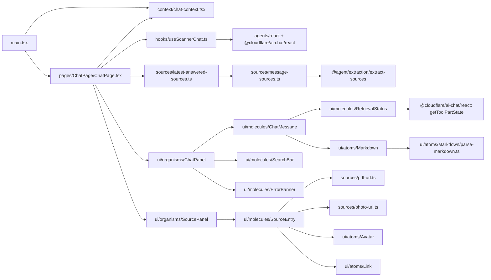

# App — Chat UI

`app` is the fourth and last of the four `src/` modules (see [docs/architecture.md](../docs/architecture.md)).
It is a Vite + React 19 single-page app: a chat surface that lets a person ask a question, watch a
grounded answer stream in from `agent`'s `ScannerAgent` Durable Object, and see which CVs the answer
cited — each one clickable through to its generated PDF. It owns no orchestration or retrieval logic
of its own; it consumes `agent`'s chat protocol as-is and derives sources from the same tool results
the Worker already streams.

This page documents the module **as built** — file by file, with the actual data flow — as opposed
to [openspec/changes/add-app](../openspec/changes/add-app/design.md), which records *why* it was
designed this way. Update this page whenever `src/app/` changes shape; treat the OpenSpec change as
the historical decision record, not the source of truth for current behavior once the two drift.

> This file is plain Markdown with fenced ` ```mermaid ` blocks, the format VitePress renders
> natively once the docs site is wired up — no VitePress-specific syntax is used, so it also renders
> as-is on GitHub today.

## Entry point

One: **`pnpm dev:app`** (`vite`) boots the dev server from `src/app/index.html`, which loads
`src/app/main.tsx`. That file mounts `ChatProvider` (session identity) wrapping `ChatPage` (the one
screen) into `#root` — no router, no `App.tsx`, no barrel `index.ts` (design Decision 13). The Worker
`pnpm dev:agent` boots separately; the two must both be running (see Configuration below).

## Module layout

```
src/app/
├── index.html                        Vite entry document (root of the Vite root)
├── main.tsx                          the module's only root file: mounts ChatProvider + ChatPage
├── styles/global.css                 reset, CSS custom properties (design tokens), base typography
├── context/chat-context.tsx          ChatProvider + useChatSession: sessionId (localStorage)
├── hooks/useScannerChat.ts           the only file importing `agents`/`@cloudflare/ai-chat`
├── sources/
│   ├── pdf-url.ts                    source path ("data/cvs/x.pdf") → dev-server URL ("/cvs/x.pdf")
│   ├── photo-url.ts                  candidate id ("jane-doe") → portrait URL ("/photos/jane-doe.png")
│   ├── message-sources.ts            UIMessage's tool-scan-cv parts → SourceReference[] (via @agent)
│   └── latest-answered-sources.ts    message list → most recent answered turn's sources
├── pages/ChatPage/ChatPage.tsx       composes ChatPanel + SourcePanel, owns the session/chat hooks
└── ui/
    ├── atoms/       Button, Input, Text, Heading, Container, Badge, Spinner, Link, Avatar, Markdown
    ├── molecules/   SearchBar, SourceEntry, RetrievalStatus, ErrorBanner, ChatMessage
    └── organisms/   ChatPanel, SourcePanel
```

Every `.ts`/`.tsx` with behavior has a colocated `*.test.ts(x)` — no `__tests__/` tree (design
Decision 13; corrects [docs/atomic-design.md](../docs/atomic-design.md), whose own §5 sketch is fixed
alongside this module).

### Internal dependency graph



`hooks/useScannerChat.ts` is the only file in `src/app` importing the agents SDK (`agents/react`,
`@cloudflare/ai-chat/react`) — everything above it deals only in plain `UIMessage`s and the narrowed
`{ messages, ask, state }` shape. `sources/message-sources.ts` is the only file performing the deep,
deliberately narrow cross-module import of `@agent/extraction/extract-sources` (design Decision 6).

## Request flow (`pnpm dev:app` + `pnpm dev:agent`)

```mermaid
sequenceDiagram
    participant User
    participant ChatPage
    participant Hook as hooks/useScannerChat.ts
    participant SDK as agents/react + @cloudflare/ai-chat/react
    participant Proxy as Vite dev server proxy (/agents)
    participant DO as ScannerAgent (Durable Object, :8787)

    User->>ChatPage: types a question, submits
    ChatPage->>Hook: ask(question)
    Hook->>SDK: sendMessage({ text: question })
    SDK->>Proxy: WebSocket frame (cf_agent_use_chat_request)
    Proxy->>DO: forwarded as-is (ws: true, same message)
    DO-->>Proxy: streamed UI message chunks (text + tool-scan-cv parts)
    Proxy-->>SDK: forwarded as-is
    SDK-->>Hook: messages (updated), isStreaming
    Hook-->>ChatPage: { messages, ask, state }
    ChatPage->>ChatPage: latestAnsweredSources(messages)
    ChatPage-->>User: ChatPanel renders the message bubbles + RetrievalStatus; SourcePanel renders the sources
```

On reload, `useAgentChat`'s `getInitialMessages` calls the Durable Object's `/get-messages` HTTP
endpoint (also through the Vite proxy) and replays the persisted transcript — `sources/message-sources.ts`
re-derives the latest answered turn's cited CVs from that replayed data exactly as it would for a live
turn, so no separate "restore sources" path exists.

## Components

### `context/chat-context.tsx`
`ChatProvider` reads a `sessionId` from `localStorage` on first render (`crypto.randomUUID()` when
absent, then persisted), and exposes it plus `startNewConversation()` via `useChatSession()`. Starting
a new conversation mints and stores a fresh id — the previous session's Durable Object is left intact,
just unreachable from the UI (design Decision 5).

### `hooks/useScannerChat.ts`
`useScannerChat({ sessionId })` composes `useAgent({ agent: "scanner-agent", name: sessionId })` (opens
the WebSocket, `agents/react`) with `useAgentChat({ agent })` (`@cloudflare/ai-chat/react`, the chat
transport, history replay, streaming), and narrows the SDK's wide return value to
`{ messages, ask, state }`. `state` is derived, never stored: `"streaming"` while `isStreaming`,
`"error"` when `connectionError` or the chat's own `error` is set, `"idle"` otherwise — so no code path
can leave the UI stuck showing progress (design Decision 10).

### `sources/pdf-url.ts`
`pdfUrl(source)`: a `"data/…"`-prefixed path becomes `"/…"` (the Vite `publicDir` root); anything else
passes through unchanged. Pure, one branch, no browser APIs.

### `sources/photo-url.ts`
`photoUrl(candidateId)`: `"jane-doe"` becomes `"/photos/jane-doe.png"`. `feed` writes portraits to
`data/photos/<candidate.id>.png` and that directory is the Vite `publicDir`, so the id alone locates the
file — no manifest fetch, and `SourceReference` needs no `photoPath` field (design Decision 17).

### `sources/message-sources.ts`
`sourcesFromMessage(message)`: filters a `UIMessage`'s parts to tool parts with an available output
(`isToolUIPart` + a defined `output`), maps each to `{ toolName, output }` via `getToolName` (from
`"ai"`), and hands the list to `extractSources` — the exact same function `agent` uses server-side, so
the de-duplication-by-candidate and score-ordering rules exist in one place for both.

### `sources/latest-answered-sources.ts`
`latestAnsweredSources(messages)`: walks the message list from the end, returning the first non-empty
`sourcesFromMessage` result, or `[]` if none. Backs `SourcePanel`'s "most recent answered turn" scope —
and, since Decision 8's revision, it is the *only* path that reaches `sourcesFromMessage`, because
`ChatMessage` no longer shows sources of its own.

### `ui/atoms/*`
`Button`, `Input`, `Text`, `Heading`, `Container`, `Badge`, `Spinner`, `Link`, `Avatar`, `Markdown` — the
only components that emit raw JSX elements, per [docs/atomic-design.md](../docs/atomic-design.md)'s core
rule. `Container` is the layout primitive every molecule/organism wraps in instead of a bare `<div>`;
`Link` always opens `target="_blank" rel="noreferrer"`.

Two of them carry behavior worth naming:

- **`Avatar`** — a round `` with the person's name as its accessible name, swapping to their initials
  in a `role="img"` span on the image's `error` event, so a missing portrait never renders broken
  (design Decision 17).
- **`Markdown`** — renders the Markdown subset the agent's answers arrive in. `parse-markdown.ts`, beside
  it, is a pure parser producing blocks (`paragraph`, `list` with `ordered`) of inline nodes (`text`,
  `strong`, `emphasis`, `code`); the component maps those to elements. Markup the parser doesn't
  recognize — including a `**` a streamed chunk cut in half — falls through as literal text. No
  `dangerouslySetInnerHTML`, so nothing in a model-authored answer can inject HTML, and no Markdown
  dependency (design Decision 16).

### `ui/molecules/*`
- **`SearchBar`** — local input state; submits on the send control or Enter; never submits empty or
  whitespace-only text; clears after submitting.
- **`SourceEntry`** — one row of the source panel: an `Avatar` (`photoUrl(source.candidateId)`) beside a
  `Link` (to `pdfUrl(source.source)`) wrapping a `Badge` with the candidate's name. The name is the only
  link, so its accessible name is exactly the candidate (design Decision 8).
- **`RetrievalStatus`** — reads a tool part's state via `getToolPartState` (`@cloudflare/ai-chat/react`);
  renders "searching the CVs" (`Spinner` + `Text`) while the state is `"loading"`/`"streaming"`, nothing
  once it's `"complete"`/`"error"`/`"denied"`.
- **`ErrorBanner`** — a persistent `role="alert"` composition of `Badge` + `Text`; never a toast (design
  Decision 10).
- **`ChatMessage`** — one chat bubble per `UIMessage`: the user's aligned right over
  `--color-bubble-user-bg` (a muted sage), the assistant's left over `--color-bubble-assistant-bg` (a
  warm grey), with the author still written out ("You"/"Assistant") in a small muted `Heading` so the
  distinction does not rest on colour and position alone. Parts render in order — the assistant's text
  through `Markdown`, the user's literally through `Text`, tool parts through `RetrievalStatus`. It
  renders **no** source entries and does not import `sourcesFromMessage` (design Decisions 8 and 15).

### `ui/organisms/*`
- **`ChatPanel`** — renders the given `messages` via `ChatMessage`, a `Spinner` while `state ===
  "streaming"`, an `ErrorBanner` while `state === "error"`, and a `SearchBar` wired to `onAsk` (disabled
  while streaming). Purely prop-driven — it does not call `useScannerChat` itself. The organism *is* the
  card (border, `--color-surface`, `--radius-panel`), with the scrolling message list and the composer
  inside it, so its edges are the column's edges and it matches `SourcePanel` beside it.
- **`SourcePanel`** — the only place a turn's cited CVs appear: the given `sources` as a vertical list of
  `SourceEntry` rows, one per candidate in descending score order, or "No CVs have been cited yet." when
  empty.

### `styles/global.css`
The reset plus every design token. Colour is three warm, low-brightness surfaces rather than white —
`--color-bg` (the page, which recedes), `--color-surface` (the message list, the source panel, the
input), `--color-bg-subtle` (fills inside those: badges, code, the avatar fallback, row hover) — with a
desaturated slate `--color-primary`, a sage/warm-grey bubble pair, and `--color-text-muted` /
`--color-danger` chosen to clear WCAG AA (4.5:1) against the *darkest* surface they sit on, not just the
lightest. Interactive controls (the secondary `Button`, the `Input`) take `--color-border-strong` rather
than `--color-border`: it clears 3:1 against every surface, which is what WCAG 1.4.11 asks of a control's
boundary and what `--color-border` (1.2–1.35:1) could not give once the page stopped being white. Layout tokens: `--content-max-width` (84rem, the page's own measure), `--radius-panel`,
`--radius-bubble`, `--avatar-size`.

### `pages/ChatPage/ChatPage.tsx`
The one screen. Calls `useChatSession()` and `useScannerChat({ sessionId })`, computes
`latestAnsweredSources(messages)`, and composes a "New conversation" `Button`, `ChatPanel`, and
`SourcePanel`. Its grid is capped at `--content-max-width` and centred with `--spacing-8` of page
padding, so the content keeps a margin inside the viewport instead of running edge to edge. Two rows: a
header spanning both columns (the "New conversation" control), then one row holding both panels — which
is what makes the conversation and the cited CVs the same height, by construction rather than by sizing
two columns to match. Below 60rem it collapses to one column with the source panel beneath the
conversation. The only place these two hooks are combined — organisms below it stay hook-free and
prop-driven.

### `main.tsx`
Mounts `<ChatProvider><ChatPage /></ChatProvider>` into `#root` inside `<StrictMode>`, and imports
`styles/global.css`. The module's only root-level file (design Decision 13; `docs/code-conventions.md`'s
"no loose files" rule permits exactly the entry point at a module root).

## Testing

Per [docs/tdd.md](../docs/tdd.md), every behavior above was driven out test-first with Vitest +
`@testing-library/react` + `@testing-library/user-event`. Per
[design.md Decision 12](../openspec/changes/add-app/design.md#decision-12--tests-mock-at-the-usescannerchat-seam-no-worker-no-websocket-no-credentials):

- **Atoms and molecules** render directly and assert on behavior (a click calls a handler, an entry links
  to the right `href`, a failed portrait falls back to initials) — never snapshots. `parse-markdown.ts` is
  tested as the pure function it is, separately from the atom that renders its output.
- **Organisms** (`ChatPanel`, `SourcePanel`) take plain props; their tests pass in-memory `UIMessage`
  fixtures, including one carrying a `tool-scan-cv` part, with no mocking needed.
- **`ChatPage`** and **`main.tsx`** mock `hooks/useScannerChat` (`vi.mock`), so the full render tree —
  including a full turn (question → user message → streamed answer → the turn's candidates appearing
  exactly once, in the panel → PDF link) and the reload case (mounting with a replayed history) — is
  exercised with no network, no Worker, and no WebSocket.
- **`hooks/useScannerChat.test.ts`** mocks `agents/react` and `@cloudflare/ai-chat/react` directly
  (`vi.hoisted`), asserting only what the hook adds: the derived state and the narrowed shape. One test
  asserts it writes nothing to `localStorage`/`sessionStorage` of its own.
- **`sources/*`** are pure functions, tested as such.
- No test file needs a running Worker, a WebSocket, or any credential — `pnpm test` stays green with
  none of them, same posture as `agent`.

`vitest.setup.ts` (repo root) calls `@testing-library/react`'s `cleanup()` after every test in the
`app` project, since the aliases are shared but globals are not enabled.

## Configuration

- **`vite.config.ts`** (repo root): `root: "src/app"` (so `src/app/index.html` is the entry document),
  `publicDir` pointing at the repo's `data/` (so `data/cvs/<id>.pdf` serves at `/cvs/<id>.pdf`),
  `plugins: [react()]`, `@app`/`@agent` aliases mirroring `tsconfig.json`, and `server.proxy` forwarding
  `/agents` (including the WebSocket upgrade, `ws: true`) to `http://localhost:8787` — the port
  `wrangler dev` listens on. Every request is same-origin from the browser's point of view; no CORS
  configuration on the Worker, no `VITE_*` environment variable (design Decisions 2 and 3).
- **`tsconfig.app.json`**: extends the root config, adds `lib: [..., "DOM", "DOM.Iterable"]`,
  `jsx: "react-jsx"`, `types: ["vite/client"]`, `include: ["src/app"]`. The root `tsconfig.json`
  excludes both `src/agent` and `src/app` — three non-overlapping type universes (Node, Workers, DOM)
  that cannot share one `tsc` program (design Decision 11, mirroring the `src/agent` split already in
  place). `pnpm exec tsc --noEmit -p tsconfig.app.json` type-checks this module on its own.
  Cursor loads the nearest `tsconfig.json`, not `tsconfig.app.json`, so `src/app/tsconfig.json`
  extends it — the same editor split as `src/agent/tsconfig.json` — and is what puts `vite/client`
  (and its `*.module.css` declarations) in scope while editing.
- **`vitest.config.ts`**: two `test.projects`, each redeclaring the shared `@feed`/`@rag`/`@agent`/
  `@app`/`@data` aliases (projects are independent Vite configs and don't inherit the root's
  `resolve.alias`) — `node` (`src/{feed,rag,agent}/**/*.test.ts`) and `app`
  (`src/app/**/*.test.{ts,tsx}`, `environment: "jsdom"`, `setupFiles: ["./vitest.setup.ts"]`). One
  `pnpm test` still runs the whole suite.
- **`package.json`**: `"dev:app": "vite"`. `react`, `react-dom`, `@ai-sdk/react` as exact-version
  runtime deps (satisfying `@cloudflare/ai-chat@0.12.0`'s peer range); `vite`, `@vitejs/plugin-react`,
  `@types/react`, `@types/react-dom`, `jsdom`, `@testing-library/react`,
  `@testing-library/user-event` as exact-version dev deps.
- **Env**: none of `app`'s own — it reads no `.env` variable and holds no credential. It depends on
  `agent`'s Worker running (which does need its own env) and on `data/` being populated by
  `pnpm generate:cvs` + `pnpm ingest:cvs`.

## Output

`app` writes nothing to disk. `pnpm dev:app` serves the SPA locally via Vite; `vite build` is not part
of any workflow and no deployment target exists for this module (design Non-goals). The only
"artifact" a person interacts with is the browser tab at `http://localhost:5173`.

## Manual verification (2026-09-27, against the real Worker, the live Upstash index, and the real model)

No browser-automation tool was available to click through the UI directly, so verification was done at
the protocol level: both `pnpm dev:agent` and `pnpm dev:app` were started for real against the
already-populated `data/` (25 generated CVs), and a raw WebSocket/HTTP client spoke the exact wire
protocol `useAgent`/`useAgentChat` use, through the same Vite proxy path (`ws://localhost:5173/agents/scanner-agent/<id>`)
the browser UI is configured to use:

- **A corpus question** ("Who has experience with React?") produced a `tool-input-available` /
  `tool-output-available` pair for `scan-cv` with real, correctly-shaped candidates
  (`candidateId`/`candidateName`/`source`/`content`/`score`), followed by a streamed, grounded answer
  naming exactly those candidates — confirming retrieval-then-answer over the proxied path, and that
  `RetrievalStatus`/`SourceEntry`/`SourcePanel` would receive the shape they expect.
  `curl http://localhost:5173/cvs/<id>.pdf` and `.../photos/<id>.png` confirmed the `publicDir` serves
  both the PDF a source entry links to and the portrait its `Avatar` shows.
- **Reload / session replay**: `GET /agents/scanner-agent/<same-id>/get-messages` (the endpoint
  `useAgentChat`'s `getInitialMessages` calls) through the proxy returned the exact persisted
  `tool-scan-cv` part from the turn above, in the shape `sourcesFromMessage` expects — confirming a
  reload replays history with re-derivable cited CVs. "New conversation" minting a new `sessionId` (and
  the previous session's Durable Object staying reachable by its old id) is covered directly by
  `ChatPage.test.tsx` and was not re-verified manually.
- **Failure path**: with the Worker process killed, a WebSocket connect through the Vite proxy fired an
  `error` event — what `useAgent` surfaces as `connectionError`, which `useScannerChat` derives into
  `state: "error"` (unit-tested rendering `ErrorBanner`). Restarting the Worker and repeating the corpus
  question succeeded again.
- **Out-of-scope question** ("What's the weather like in Paris today?") produced no `tool-input-available`
  chunk at all and a declining answer stating the assistant's actual scope — matching
  `agent-orchestration`'s scope contract as it would appear in the UI (no retrieval indicator, no cited
  CVs for that turn).

Pronoun resolution across turns and the model's groundedness/scope behavior in general are `agent`'s own
responsibility, already verified there (see [context/agent.md](agent.md)); this session re-verified only
that `app`'s wiring (proxy, session addressing, message shapes) carries that behavior through unchanged.

## Related docs

- [docs/architecture.md](../docs/architecture.md) — where `app` sits in the overall system; §2 records
  the narrow `@agent/extraction/extract-sources` import exception this module relies on.
- [docs/atomic-design.md](../docs/atomic-design.md) — the component hierarchy and no-raw-JSX-above-atoms
  rule this module's `ui/` tree follows.
- [docs/code-conventions.md](../docs/code-conventions.md) — file layout rules applied throughout this
  module (no loose files, named parameters, visual block separation).
- [openspec/changes/add-app/design.md](../openspec/changes/add-app/design.md) and
  [.../specs/app-chat/spec.md](../openspec/changes/add-app/specs/app-chat/spec.md) /
  [.../specs/app-sources/spec.md](../openspec/changes/add-app/specs/app-sources/spec.md) — the original
  design rationale (14 decisions) and behavioral spec this implementation derives from.
- [openspec/changes/add-app/tasks.md](../openspec/changes/add-app/tasks.md) — the task-by-task
  implementation log, including the `exactOptionalPropertyTypes` fix (every atom's `className?: string`
  widened to `string | undefined`, since `noUncheckedIndexedAccess` types a CSS Modules property access
  as possibly-`undefined`) not anticipated when design.md was written.
- [src/app/README.md](../src/app/README.md) — the quick-start a new contributor reads first.
