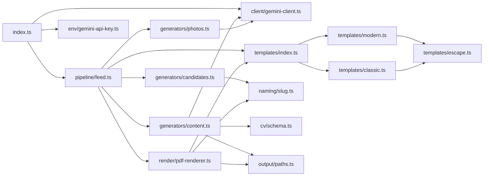
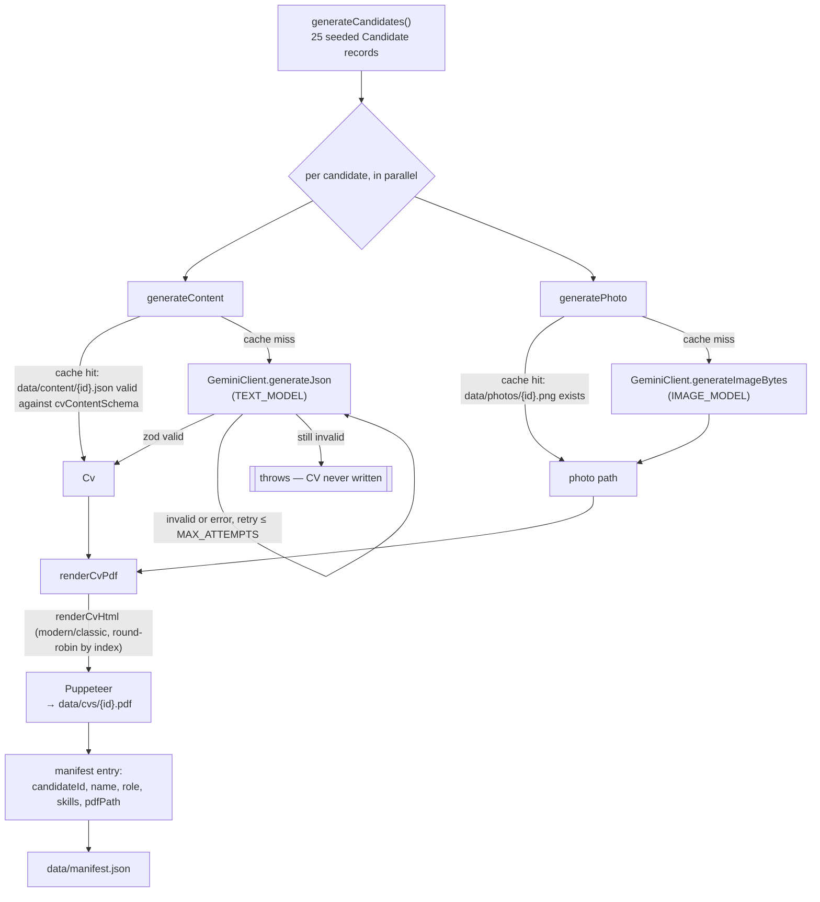
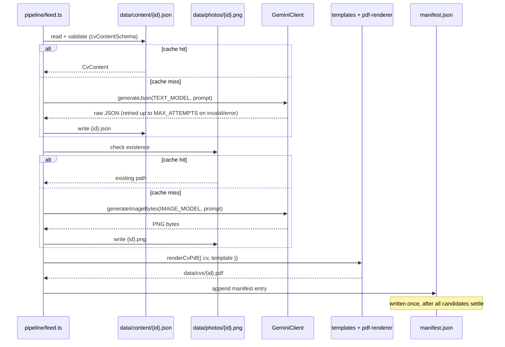

# Feed — CV Generation Pipeline

`feed` is the first of the four `src/` modules (see [docs/architecture.md](../docs/architecture.md)).
It has no inputs beyond a Gemini API key: it invents 25 fictional candidates, asks an LLM to write
their CV narrative and a photorealistic portrait, renders each into a PDF via an HTML/CSS template,
and writes a `manifest.json` ground truth for later `rag` validation.

This page documents the module **as built** — file by file, with the actual data flow — as opposed
to [openspec/changes/add-cv-generation](../openspec/changes/add-cv-generation/design.md), which
records *why* it was designed this way. Update this page whenever `src/feed/` changes shape; treat
the OpenSpec change as the historical decision record, not the source of truth for current behavior
once the two drift.

> This file is plain Markdown with fenced ` ```mermaid ` blocks, the format VitePress renders
> natively once the docs site is wired up — no VitePress-specific syntax is used, so it also renders
> as-is on GitHub today.

## Entry point

`pnpm generate:cvs` runs `src/feed/index.ts`, which loads `.env`, fails fast via
`requireGeminiApiKey` if `GEMINI_API_KEY` is missing, builds one `GeminiClient`, and calls
`feed({ client, dataDir: DATA_DIR })` (`pipeline/feed.ts`), the single orchestrator for the whole
module.

## Module layout

```
src/feed/
├── index.ts                 entry point (`pnpm generate:cvs`)
├── pipeline/feed.ts          orchestrator: wires every step below, writes manifest.json
├── env/gemini-api-key.ts     GEMINI_API_KEY presence check
├── client/gemini-client.ts   thin Gemini SDK wrapper (generateJson, generateImageBytes)
├── cv/
│   ├── types.ts               Candidate / Cv / CvContent / CvExperience / CvEducation
│   └── schema.ts               Zod mirror of Cv, used to validate LLM output
├── generators/
│   ├── candidates.ts          deterministic candidate metadata (seeded faker)
│   ├── content.ts              LLM narrative content, cached, retried
│   └── photos.ts                LLM portrait, cached
├── naming/slug.ts             filesystem/URL-safe slug from a name
├── output/paths.ts             data/ directory + file path constants
├── templates/
│   ├── index.ts                 template registry + renderCvHtml dispatcher
│   ├── modern.ts, classic.ts     HTML/CSS templates (LLM never touches layout)
│   └── escape.ts                 HTML-escaping shared by both templates
└── render/pdf-renderer.ts      HTML → PDF via Puppeteer
```

### Internal dependency graph



## Pipeline flow

`feed()` generates the 25 candidates once, then runs the four steps below **in parallel across
candidates** (each candidate's own steps stay sequential; only the LLM calls are throttled, see
[Concurrency](#concurrency-and-retries)):



### Sequence for one candidate



## Components

### `generators/candidates.ts`
Builds all 25 (`CANDIDATE_COUNT`) candidates from a seeded `faker` (default seed `42`, so a re-run
without changing the seed reproduces identical metadata) plus predefined lists for role, sector,
language, seniority, and appearance. Each field rotates through its list with `pick({ list, index,
stride })`, a stride coprime-ish offset per field so role/sector/language/appearance don't
correlate by candidate index. `id` is `slugify("firstName lastName")`, de-duplicated with a numeric
suffix on collision.

### `generators/content.ts`
Calls `GeminiClient.generateJson` with `TEXT_MODEL`, asking for a JSON object matching
`cvContentSchema` (`summary`, `experience[]`, `education[]`, `skills[]`) in the candidate's own
`language`. Retries up to `MAX_ATTEMPTS` (3) on a schema-invalid response or a thrown error; never
writes or returns unvalidated content. Results are cached at `{dataDir}/content/{candidateId}.json`
— a re-run with an existing, schema-valid cache file skips the LLM call entirely. The final `Cv` is
assembled by merging this narrative content with the candidate's own deterministic contact fields
(`name`, `contact`, `photoPath`).

### `generators/photos.ts`
Calls `GeminiClient.generateImageBytes` with `IMAGE_MODEL` and a prompt built from
`candidate.appearance` (age range, gender, ethnicity) for a neutral-background corporate headshot.
Cached at `{dataDir}/photos/{candidateId}.png` by existence check only (no content validation,
unlike the content cache). Errors from the client propagate uncaught — one failed portrait fails
that candidate's whole pipeline run.

### `client/gemini-client.ts`
The **only** file allowed to talk to `@google/generative-ai` (per
[spec.md](../openspec/changes/add-cv-generation/specs/feed-cv-generation/spec.md)). Two methods:
`generateJson` (structured text output, `responseMimeType: "application/json"`) and
`generateImageBytes` (`responseModalities: ["IMAGE"]`, extracts the first `inlineData` part,
throws if the response has no image). Holds no CV domain logic, so a provider swap stays isolated
here.

### `cv/schema.ts` / `cv/types.ts`
`cvContentSchema` validates exactly the LLM's half of a `Cv` (the narrative fields); `cvSchema`
extends it with the deterministic half (`name`, `contact`, `photoPath`) for the fully assembled
record. `types.ts` is the plain-TypeScript mirror with no runtime behavior.

### `templates/`
`templates/index.ts` exposes `TEMPLATES = ["modern", "classic"]` and `renderCvHtml({ cv, template,
photoDataUri })`, dispatching to `renderModern` or `renderClassic`. `pipeline/feed.ts` alternates
templates round-robin (`TEMPLATES[index % TEMPLATES.length]`) so the generated set isn't visually
uniform. Both templates build their HTML by string interpolation and route every piece of CV text
through `escapeHtml` (`templates/escape.ts`) — the LLM's output is untrusted text embedded into
markup, never markup itself.

### `render/pdf-renderer.ts`
Reads the candidate's photo file, inlines it as a `data:image/png;base64,...` URI (no external
file references inside the HTML given to Puppeteer), renders the template to a string, and prints
it to `{outputDir}/{fileBaseName}.pdf` (A4, background graphics on) via a Puppeteer page. Puppeteer
is launched and closed per call — kept as thin glue, no shared browser instance.

### `naming/slug.ts`
`slugify(value)`: NFD-normalizes, strips diacritics, lowercases, and collapses non-alphanumerics
into single hyphens. Used both for candidate IDs (`generators/candidates.ts`) and as the default
PDF file base name (`render/pdf-renderer.ts`, overridden by `pipeline/feed.ts` to reuse the
candidate's own `id` instead of re-deriving one from the name).

### `pipeline/feed.ts`
The orchestrator. Generates candidates once, then per candidate: content → photo → PDF (each
awaited in that order for a given candidate), collecting one `ManifestEntry` per CV. All entries
are written together to `{dataDir}/manifest.json` once every candidate has settled — a partial
failure during the `Promise.all` throws before any manifest is written, rather than leaving a
truncated one on disk.

## Concurrency and retries

Both LLM-calling steps (`generateContent`, `generatePhoto`) run through the same `llmLimit` —
a `p-limit(LLM_CONCURRENCY)` (currently `2`) shared instance exported from `content.ts` — so no
more than two Gemini requests (text or image, combined) are in flight at once, sized conservatively
for the free tier. Content generation additionally retries up to `MAX_ATTEMPTS` (3) attempts before
failing that candidate; photo generation has no retry of its own.

## Caching

Both caches are **file-existence based**, keyed by `candidateId`, and make repeated
`pnpm generate:cvs` runs cheap and idempotent:

| Cache | Path | Validated on read? |
| --- | --- | --- |
| Content | `data/content/{candidateId}.json` | Yes — re-parsed against `cvContentSchema`; an invalid file is treated as a cache miss |
| Photo | `data/photos/{candidateId}.png` | No — existence only |

## Output

```
data/
├── content/{candidateId}.json   cached LLM narrative (not itself a deliverable)
├── photos/{candidateId}.png     AI-generated portraits
├── cvs/{candidateId}.pdf        final deliverable, one per candidate
└── manifest.json                [{ candidateId, name, role, skills, pdfPath }, ...]
```

`data/` is gitignored — everything under it is regenerated output, not source.

## Configuration

- **Env**: `GEMINI_API_KEY` (Google AI Studio), loaded from a local `.env` via `dotenv/config`,
  enforced by `requireGeminiApiKey` before any pipeline work starts.
- **Models**: `TEXT_MODEL` (`generators/content.ts`) and `IMAGE_MODEL` (`generators/photos.ts`) are
  private constants, each used in exactly one file — check those two files directly for the current
  model IDs rather than trusting a copy of the name here, since Gemini model availability shifts
  faster than this doc does.

## Testing

Per [docs/tdd.md](../docs/tdd.md), every behavior above was driven out test-first with Vitest.
`client/gemini-client.ts` is the single mocking boundary: every generator test mocks
`GeminiClient`'s methods, so the suite never touches the network. Run with `pnpm test`.

## Related docs

- [docs/architecture.md](../docs/architecture.md) — where `feed` sits in the overall system.
- [docs/code-conventions.md](../docs/code-conventions.md) — file layout rules applied throughout
  this module (no loose files, named parameters, visual block separation).
- [openspec/changes/add-cv-generation/design.md](../openspec/changes/add-cv-generation/design.md)
  and [.../specs/feed-cv-generation/spec.md](../openspec/changes/add-cv-generation/specs/feed-cv-generation/spec.md)
  — the original design rationale and behavioral spec this implementation derives from.
