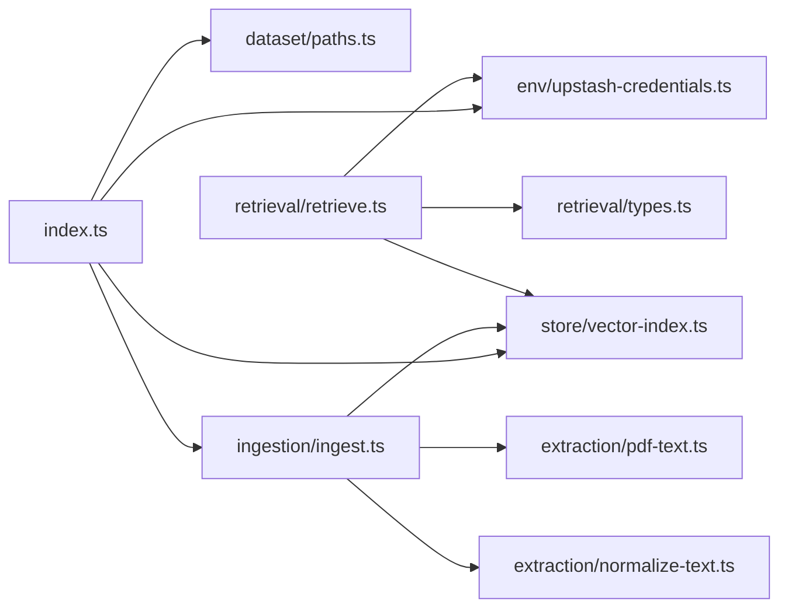
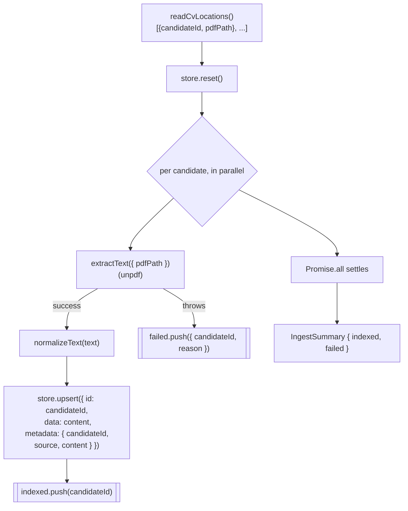
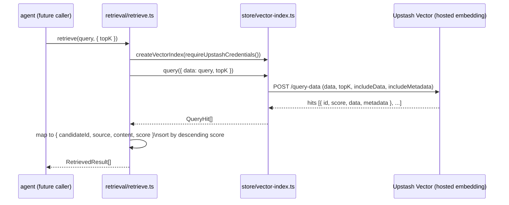

# RAG — Ingestion + Retrieval

`rag` is the second of the four `src/` modules (see [docs/architecture.md](../docs/architecture.md)).
It turns `feed`'s 25 CV PDFs into a queryable vector index and exposes a single narrow function,
`retrieve(query, { topK })`, for `agent` to call. `rag` never calls an LLM to answer anything — it
only extracts, normalizes, indexes, and ranks.

This page documents the module **as built** — file by file, with the actual data flow — as opposed
to [openspec/changes/add-rag-retrieval](../openspec/changes/add-rag-retrieval/design.md), which
records *why* it was designed this way. Update this page whenever `src/rag/` changes shape; treat
the OpenSpec change as the historical decision record, not the source of truth for current behavior
once the two drift.

> This file is plain Markdown with fenced ` ```mermaid ` blocks, the format VitePress renders
> natively once the docs site is wired up — no VitePress-specific syntax is used, so it also renders
> as-is on GitHub today.

## Entry point

`pnpm ingest:cvs` runs `src/rag/index.ts`, which loads `.env`, fails fast via
`requireUpstashCredentials` if `UPSTASH_VECTOR_REST_URL`/`UPSTASH_VECTOR_REST_TOKEN` are missing,
builds one `VectorIndex` (`store/vector-index.ts`), reads `data/manifest.json`, and calls
`ingest({ store, cvLocations })` (`ingestion/ingest.ts`), the single orchestrator for the ingestion
half. The retrieval half has no entry point script — `retrieval/retrieve.ts` is a plain function
`agent` imports directly, not something run standalone.

## Module layout

```
src/rag/
├── index.ts                        entry point (`pnpm ingest:cvs`)
├── env/upstash-credentials.ts      UPSTASH_VECTOR_REST_URL/TOKEN presence check
├── dataset/paths.ts                rag's own data/ paths + CV locations reader (manifest.json)
├── extraction/
│   ├── pdf-text.ts                  extractText({ pdfPath }) over unpdf
│   ├── normalize-text.ts            re-joins letter-spaced headings, collapses whitespace
│   ├── cv-word-budget.test.ts       gated: confirms every real CV stays under the no-chunking budget
│   └── fixtures/                    sample.pdf / invalid.txt, used only by pdf-text.test.ts
├── store/vector-index.ts           the only file importing @upstash/vector
├── ingestion/ingest.ts              reset + per-candidate upsert, returns a result summary
└── retrieval/
    ├── types.ts                     RetrievedResult
    ├── retrieve.ts                  the public interface agent imports
    └── ground-truth.test.ts         gated: live retrieval vs. manifest.json ground truth
```

### Internal dependency graph



`ingestion/ingest.ts` and `retrieval/retrieve.ts` never import each other — the only thing they
share is `store/vector-index.ts`, the vendor-isolation seam.

## Ingestion flow



`index.ts` logs the indexed count and, if `failed` is non-empty, prints each failing candidate and
`process.exit(1)` — the same failure posture `feed` uses. A single unreadable PDF never aborts the
others: `ingest()` catches per-candidate inside the `Promise.all` map, not around the whole loop.

## Retrieval flow



Upstash performs the embedding call on both the upsert side and the query side — `rag` sends and
receives plain text (`data: string`), never a float vector, and never calls a separate embedding
API itself.

## Components

### `env/upstash-credentials.ts`
`requireUpstashCredentials(env)` mirrors `feed/env/gemini-api-key.ts`: trims and requires
`UPSTASH_VECTOR_REST_URL` and `UPSTASH_VECTOR_REST_TOKEN`, throwing a named error for whichever is
missing or whitespace-only, before any network call is made. Returns `{ url, token }`. Notably does
**not** validate `OPENAI_API_KEY` — that variable authorizes Upstash's own call to OpenAI and is
entered once in the Upstash console at index-creation time, stored server-side there. No `rag` code
reads it (verified empirically: a raw `upsert-data` REST call with no OpenAI key anywhere in the
request succeeded and the vector was retrievable with a real similarity score).

### `dataset/paths.ts`
`DATA_DIR`/`CVS_DIR`/`MANIFEST_PATH` constants (`rag`'s own copies, not imported from `@feed/*` —
crossing into a sibling module's internals is forbidden per `docs/architecture.md` §2) plus
`readCvLocations(manifestPath?)`, which reads `data/manifest.json` and narrows each entry down to
one `CvLocation` (`{ candidateId, pdfPath }`), dropping `feed`'s other fields (`name`, `role`,
`skills`) that `rag` has no use for. The name says what comes back — a list of CV locations, not
the manifest itself — so callers aren't misled into expecting `feed`'s full entries.

### `extraction/pdf-text.ts`
`extractText({ pdfPath })`: reads the file, hands the bytes to `unpdf`'s `getDocumentProxy` +
`extractText({ mergePages: true })`, and returns the merged string. Any failure (missing file,
invalid PDF) is caught and re-thrown as one error naming `pdfPath`, per the spec's "raise an error
identifying the offending path rather than returning empty text" requirement.

### `extraction/normalize-text.ts`
`normalizeText(text)` fixes an artifact of `feed`'s own PDF templates: both apply `letter-spacing`
to section headings, so `PROFILE` extracts as `P R O F I L E`. The regex
`/\b[A-Za-z]\b(?: \b[A-Za-z]\b){2,}/g` matches only runs of 3+ **isolated** single-letter words
(word-boundary-anchored on both sides of each letter) separated by single spaces, and removes the
spaces inside a match — so `"P R O F I L E"` → `"PROFILE"`, but ordinary prose, initials, and
stand-alone single-letter words (`"I"`, `"a"`) are untouched, since they aren't part of a run of
3+ isolated letters. A second pass collapses all whitespace runs to single spaces and trims.

### `store/vector-index.ts`
The **only** file importing `@upstash/vector`. `createVectorIndex({ url, token })` wraps an
`@upstash/vector` `Index` instance behind exactly three methods — `reset`, `upsert`, `query` — so a
future store swap touches only this file. `upsert` takes `{ id, data, metadata }` (metadata:
`{ candidateId, source, content }`); `query` takes `{ data, topK }` and always requests
`includeData`/`includeMetadata`, returning `QueryHit[]` (`{ id, score, data, metadata }`) — the
vendor's own response type never leaks past this file.

### `ingestion/ingest.ts`
`ingest({ store, cvLocations, extractText? })`: resets the store first (Decision 7's
reset-and-rebuild idempotency — a full wipe is simpler than diffing at 25 documents), then runs
every CV location through `Promise.all`, each wrapped in its own `try`/`catch` so one failure
doesn't abort the run. `extractText` is an injectable dependency (defaults to the real
`extraction/pdf-text.ts`), which is what lets `ingestion/ingest.test.ts` mock extraction without
touching the filesystem. Returns `{ indexed: string[], failed: { candidateId, reason }[] }` in
manifest order regardless of completion timing.

### `retrieval/retrieve.ts` / `retrieval/types.ts`
`retrieve(query, { topK })` is the **only** surface `agent` is meant to import from `rag`. It
builds a fresh `VectorIndex` per call (construction is a cheap synchronous wrapper, no network
call, so there's no caching to manage), queries with the raw query string as `data`, maps each hit
to `RetrievedResult` (`{ candidateId, source, content, score }`), and sorts by descending score.
Applies no score threshold and never touches `data/manifest.json` — both are `agent`'s policy to
apply, not `rag`'s.

## Testing

Per [docs/tdd.md](../docs/tdd.md), every behavior above was driven out test-first with Vitest.
Two test files are **gated**, not mocked, and exercise the real Upstash index:

| Test | Gate | What it proves |
| --- | --- | --- |
| `extraction/cv-word-budget.test.ts` | `data/cvs/` exists | Every real generated CV stays under the 500-word no-chunking budget (design.md Decision 2) |
| `retrieval/ground-truth.test.ts` | `UPSTASH_VECTOR_REST_URL`/`_TOKEN` set | A skill unique to one candidate (`"FastAPI"` → `nikita-crist`) retrieves that candidate; a cross-language query (`"time series analysis"` in English → `floy-keebler`, whose CV lists `"Anàlisi de Sèries Temporals"` in Catalan) still retrieves them |

Both gates use `describe.skipIf`/`describe.runIf` so `pnpm test` and CI stay green without
credentials or a generated dataset — the gate is an explicit skip, reported as such, not a silent
absence. Everything else (`env/`, `dataset/`, `extraction/normalize-text.ts`,
`extraction/pdf-text.ts` against a committed fixture PDF, `store/vector-index.ts`,
`ingestion/ingest.ts`, `retrieval/retrieve.ts`) is unit-tested with `@upstash/vector` mocked at the
module boundary — the suite never makes a real network call except through the two gated tests
above.

## Configuration

- **Env**: `UPSTASH_VECTOR_REST_URL` / `UPSTASH_VECTOR_REST_TOKEN` (`rag`'s runtime credentials),
  loaded from a local `.env` via `dotenv/config`, enforced by `requireUpstashCredentials` before
  any pipeline work starts. `OPENAI_API_KEY` is also kept in `.env` for reference but is a
  console-setup credential only (see `env/upstash-credentials.ts` above).
- **Vector store**: Upstash Vector index created via the console with the
  `openai/text-embedding-3-small` embedding model (1536 dimensions, cosine similarity).

## Output

Ingestion writes no files — its only output is the remote Upstash Vector index (25 vectors, one
per candidate, keyed by `candidateId`). Re-running `pnpm ingest:cvs` resets and rebuilds it from
whatever `data/manifest.json` currently lists.

## Related docs

- [docs/architecture.md](../docs/architecture.md) — where `rag` sits in the overall system; §4
  records the RAG design questions this module resolved.
- [docs/code-conventions.md](../docs/code-conventions.md) — file layout rules applied throughout
  this module (no loose files, named parameters, visual block separation).
- [openspec/changes/add-rag-retrieval/design.md](../openspec/changes/add-rag-retrieval/design.md)
  and [.../specs/rag-ingestion/spec.md](../openspec/changes/add-rag-retrieval/specs/rag-ingestion/spec.md) /
  [.../specs/rag-retrieval/spec.md](../openspec/changes/add-rag-retrieval/specs/rag-retrieval/spec.md)
  — the original design rationale (including two corrections made during implementation) and
  behavioral spec this implementation derives from.
