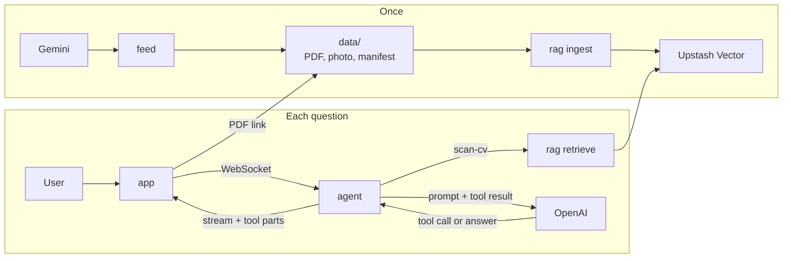
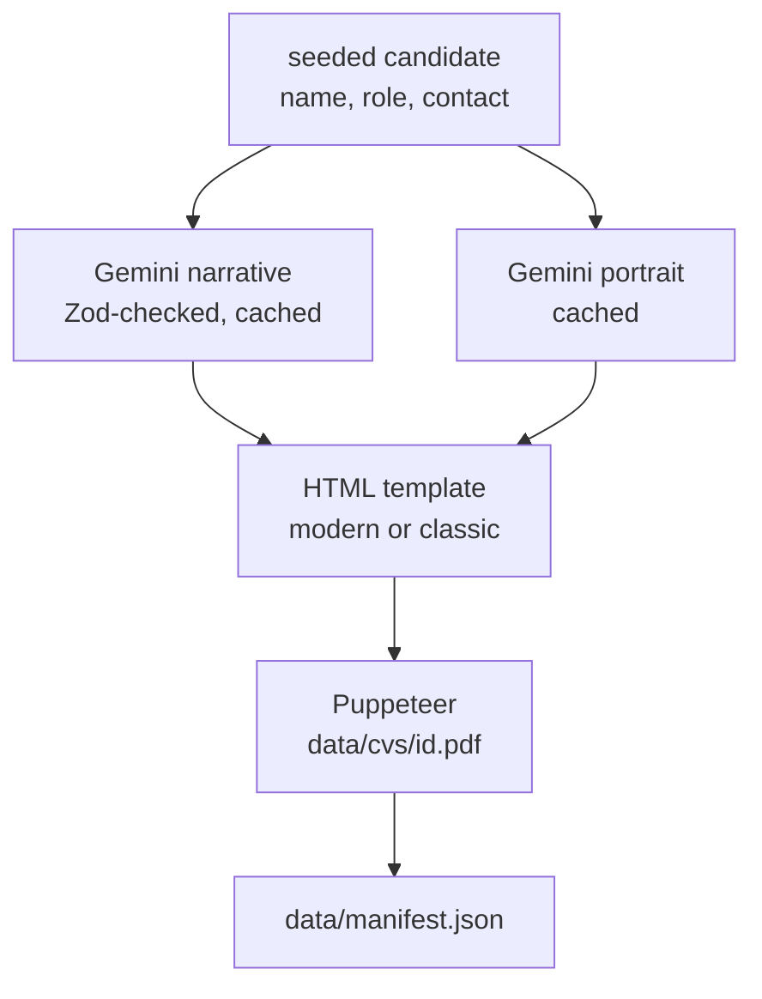
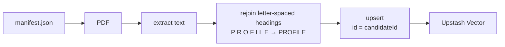
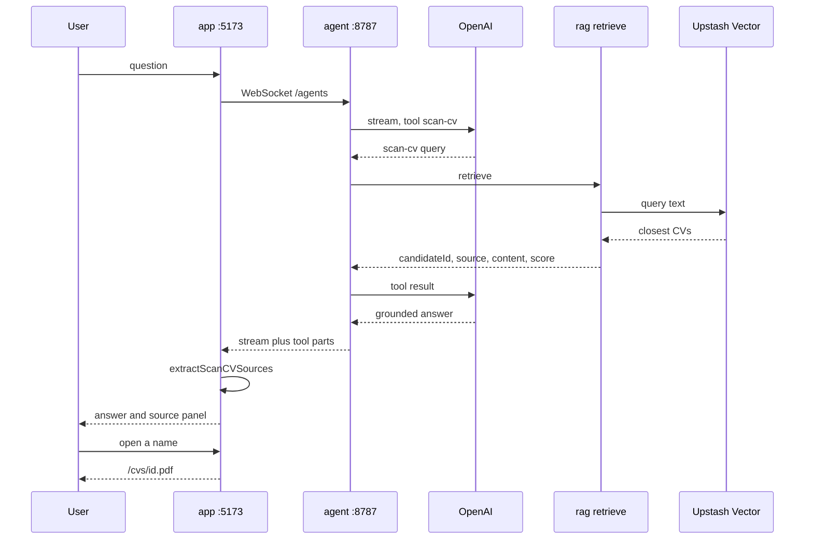

# Workflow

Four modules, all local. `feed` writes CVs once, `rag` indexes them once, and each question goes
`app` → `agent` → `rag` → Upstash, with OpenAI writing the answer from what the search returned.

| Command | What runs |
| --- | --- |
| `pnpm generate:cvs` | `feed` calls Gemini, writes `data/` |
| `pnpm ingest:cvs` | `rag` reads `data/`, rebuilds the Upstash index |
| `pnpm dev:agent` | Worker on `:8787` |
| `pnpm dev:app` | Vite on `:5173`, proxies `/agents` to the Worker |

`rag` never answers. `agent` never embeds. `app` never searches. The only shared code across a
boundary is `extractScanCVSources` (`@agent/extraction/scan-cv-sources`): server and UI both derive
cited CVs from `scan-cv` results, never from the model's sentences.

## Generation

`feed` invents 25 candidates from a seeded faker (name, role, contact stay stable across re-runs).
Gemini writes the narrative and the portrait. Layout is an HTML template, not model output.

A schema-invalid narrative is retried and never written. Text and photos are cached under
`data/content/` and `data/photos/`, so a re-run skips Gemini.

## Ingestion

One vector per CV. These résumés are a few hundred words; splitting them would separate the name
from the role. Upstash embeds the text (`openai/text-embedding-3-small`). `rag` sends plain text.

`pnpm ingest:cvs` wipes the index and rebuilds it. One unreadable PDF is recorded as failed; the
rest still index.

## A question

The model does not receive the corpus up front. It calls `scan-cv`, which is `retrieve(query, { topK })`.
The streamed answer may only use that text. The source panel is `extractScanCVSources` over the same
tool parts.

Portraits come from `/photos/{candidateId}.png`. Both URLs are `data/` served by Vite's `publicDir`.
